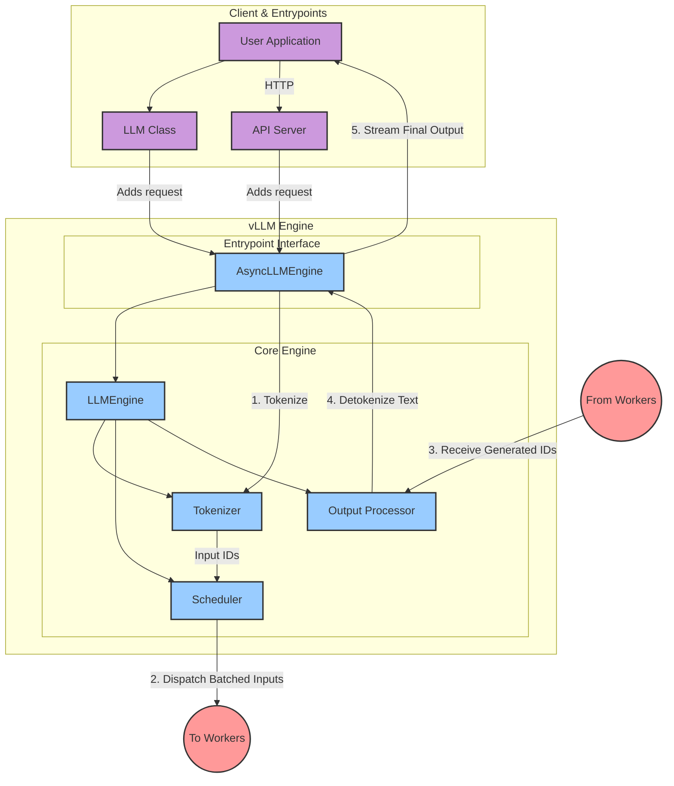
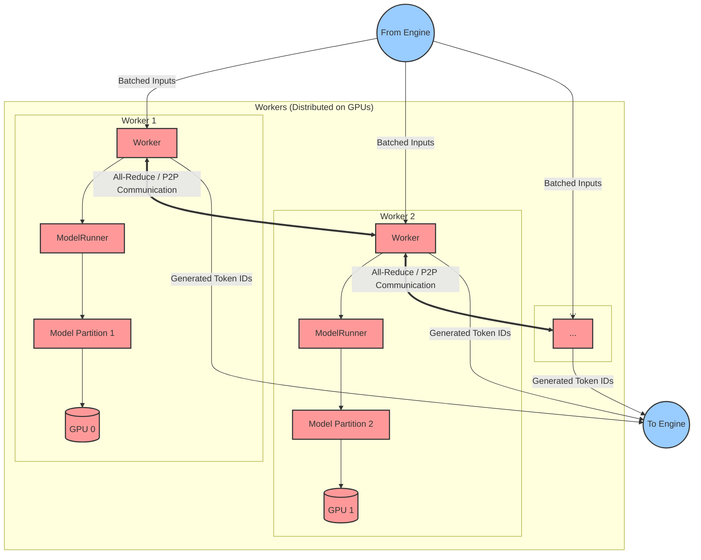

# vLLM Architecture Diagrams

This document contains two diagrams that illustrate the architecture of the vLLM engine and its workers.

## 1. vLLM Engine Architecture

This diagram shows the flow of requests from the client to the vLLM engine. The engine manages tokenization, scheduling, and processing, then dispatches tasks to the workers.

## 2. vLLM Worker Architecture

This diagram illustrates how workers receive tasks from the engine, execute the model in a distributed fashion across multiple GPUs, and send results back.

