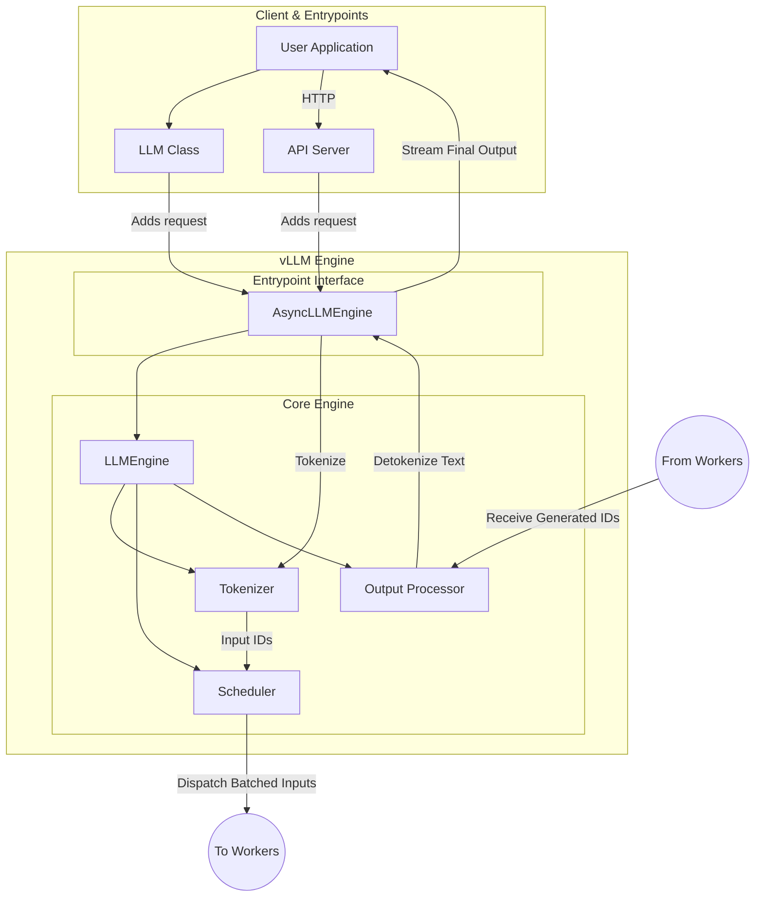
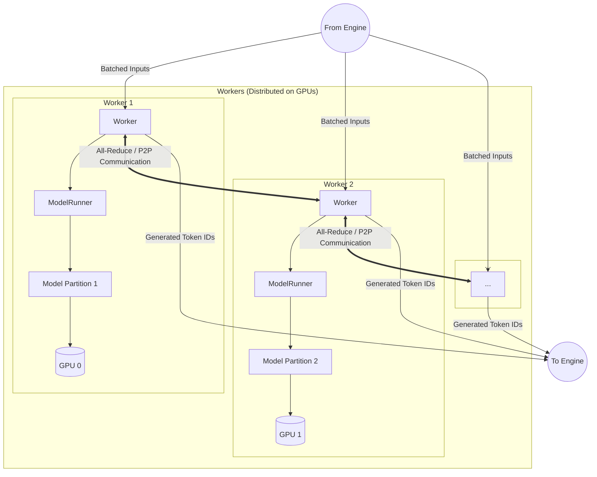
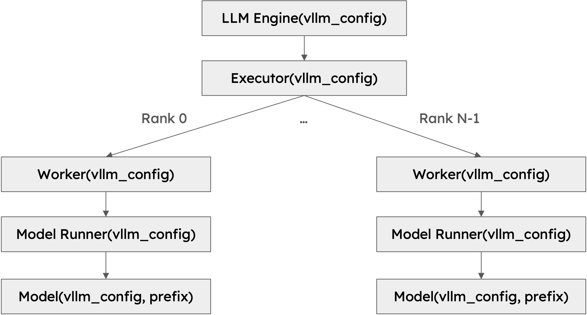

# vLLM Architecture Diagrams

This document contains two diagrams that illustrate the architecture of the vLLM engine and its workers.

## 1. vLLM Engine Architecture

This diagram shows the flow of requests from the client to the vLLM engine. The engine manages tokenization, scheduling, and processing, then dispatches tasks to the workers.
All-reduce is for tensor parallism, while P2P is for Pipeline parallelism



## 2. vLLM Worker Architecture

This diagram illustrates how workers receive tasks from the engine, execute the model in a distributed fashion across multiple GPUs, and send results back.


# vLLM Engine

The vLLM engine is the core component responsible for managing the lifecycle of inference requests. It is comprised of two main classes: `LLMEngine` and `AsyncLLMEngine`. This document provides an overview of their architecture and responsibilities, along with key code snippets.

## LLMEngine

The `LLMEngine` is the synchronous, central orchestrator of the vLLM system. It is designed for high-throughput, iteration-level scheduling and efficient memory management.

### Key Responsibilities:

1.  **Request Management**:
    *   Receives generation requests from clients, which can be either `SamplingParams` for text generation or `PoolingParams` for embedding tasks.
    *   Manages a pool of active, waiting, and swapped sequence groups.

2.  **Initialization**:
    *   Initializes the tokenizer, model executor, and KV cache in the workers.
    *   Profiles the model to determine the optimal number of GPU and CPU KV cache blocks that can be allocated.

3.  **Scheduling**:
    *   The `Scheduler` is a critical component that determines which sequence groups to run in each iteration. It employs a scheduling policy (e.g., FCFS, priority) to batch requests and manage the KV cache efficiently.
    *   It handles preemption, swapping, and copying of KV cache blocks to maximize GPU utilization.

4.  **Execution**:
    *   The `step()` method is the main entry point for a single decoding iteration. It performs the following actions:
        *   Schedules the next batch of sequence groups.
        *   Calls the distributed `ModelExecutor` to run the model forward pass.
        *   Processes the model outputs, including decoding, sampling, and applying logits processors.
        *   Updates the state of sequence groups (e.g., appending new tokens, marking them as finished).

5.  **State Management**:
    *   Maintains the state of all sequence groups, including their status (e.g., `RUNNING`, `WAITING`, `FINISHED`).
    *   Manages LoRA adapters, allowing for dynamic loading and unloading.

### Core Components:

*   **`ModelExecutor`**: An abstraction for the underlying model runner, which can be distributed across multiple GPUs or nodes.
*   **`Scheduler`**: Manages the KV cache and decides which requests to execute.
*   **`CacheEngine`**: Manages the allocation and deallocation of KV cache blocks on both GPU and CPU.
*   **`TokenizerGroup`**: Manages tokenizers, including support for LoRA-specific tokenizers.

### Important Code Snippet: `step()` Method

The `step()` method is the heart of the `LLMEngine`, driving the entire inference process for a single iteration. It encapsulates the schedule-execute-process loop.

```python
# From: vllm/engine/llm_engine.py

def step(self) -> List[Union[RequestOutput, PoolingRequestOutput]]:
    """Performs one decoding iteration and returns newly generated results."""
    
    # 1. Schedule the next batch of requests
    # This is skipped if the engine is performing multi-step decoding
    # and has remaining steps.
    if not self._has_remaining_steps(seq_group_metadata_list):
        (seq_group_metadata_list, scheduler_outputs,
         allow_async_output_proc) = self.scheduler[virtual_engine].schedule()

    # ... (error handling and state management) ...

    if not scheduler_outputs.is_empty():
        # 2. Execute the model
        # The model_executor runs the forward pass on the workers.
        execute_model_req = ExecuteModelRequest(
            seq_group_metadata_list=seq_group_metadata_list,
            blocks_to_swap_in=scheduler_outputs.blocks_to_swap_in,
            blocks_to_swap_out=scheduler_outputs.blocks_to_swap_out,
            blocks_to_copy=scheduler_outputs.blocks_to_copy,
            # ... other parameters
        )
        outputs = self.model_executor.execute_model(
            execute_model_req=execute_model_req
        )
    else:
        outputs = []

    # 3. Process model outputs and update sequence states
    # This is where tokens are appended, and requests are marked as finished.
    if not allow_async_output_proc:
        self._process_model_outputs(ctx=ctx)
        self.do_log_stats(scheduler_outputs, outputs)
        self.do_tracing(scheduler_outputs)

    return ctx.request_outputs
```
## vllm_config

 The VllmConfig class is the main configuration object that is passed around. The class hierarchy is quite deep, and every class needs to read the configuration it is interested in.

 ```python
class VllmConfig:
    """Dataclass which contains all vllm-related configuration. This
    simplifies passing around the distinct configurations in the codebase.
    """

    # TODO: use default_factory once default constructing ModelConfig doesn't
    # try to download a model
    model_config: ModelConfig = None  # type: ignore
    """Model configuration."""
    cache_config: CacheConfig = field(default_factory=CacheConfig)
    """Cache configuration."""
    parallel_config: ParallelConfig = field(default_factory=ParallelConfig)
    """Parallel configuration."""
    scheduler_config: SchedulerConfig = field(default_factory=SchedulerConfig)
    """Scheduler configuration."""
    device_config: DeviceConfig = field(default_factory=DeviceConfig)
    """Device configuration."""
    load_config: LoadConfig = field(default_factory=LoadConfig)
    """Load configuration."""
    lora_config: Optional[LoRAConfig] = None
    """LoRA configuration."""
    speculative_config: Optional[SpeculativeConfig] = None
    """Speculative decoding configuration."""
    decoding_config: DecodingConfig = field(default_factory=DecodingConfig)
    """Decoding configuration."""
    observability_config: Optional[ObservabilityConfig] = None
    """Observability configuration."""
    quant_config: Optional[QuantizationConfig] = None
    """Quantization configuration."""
    compilation_config: CompilationConfig = field(
        default_factory=CompilationConfig)
 ```

 ```python
class ParallelConfig:
    """Configuration for the distributed execution."""

    pipeline_parallel_size: int = 1
    """Number of pipeline parallel groups."""
    tensor_parallel_size: int = 1
    """Number of tensor parallel groups."""
    data_parallel_size: int = 1
    """Number of data parallel groups. MoE layers will be sharded according to
    the product of the tensor parallel size and data parallel size."""
    data_parallel_size_local: int = 1
    """Number of local data parallel groups."""
    data_parallel_rank: int = 0
    """Rank of the data parallel group."""
    data_parallel_rank_local: Optional[int] = None
    """Local rank of the data parallel group,
    set only in SPMD mode."""
    data_parallel_master_ip: str = "127.0.0.1"
    """IP of the data parallel master."""
    data_parallel_rpc_port: int = 29550
    """Port for data parallel messaging."""
    data_parallel_master_port: int = 29500
    """Port of the data parallel master."""
    data_parallel_backend: str = "mp"
    """Backend to use for data parallel, either "mp" or "ray"."""
    data_parallel_external_lb: bool = False
 ```
 The tensor_parralel_size and data_parallel_size determine the number of workers
# vLLM Worker

The `Worker` class in vLLM is responsible for executing a partition of the model on a single GPU. It is a crucial component for both single-GPU and distributed inference, managing the model, KV cache, and the execution of the forward pass.

## Key Responsibilities:

1.  **Model Execution**:
    *   The primary role of the worker is to execute the model on its assigned GPU. It receives a batch of sequence group metadata from the engine and performs the forward pass.
    *   It uses a `ModelRunner` to manage the model's execution, which can be a standard `ModelRunner`, `EncoderDecoderModelRunner`, or `PoolingModelRunner` depending on the model type.

2.  **KV Cache Management**:
    *   Each worker maintains a portion of the KV cache. The `CacheEngine` is responsible for managing the allocation, swapping, and copying of KV cache blocks.
    *   The worker executes cache operations (swap-in, swap-out, copy) as instructed by the scheduler before running the model.

3.  **Distributed Inference**:
    *   In a distributed setting, each worker is assigned a rank and a partition of the model.
    *   It initializes the distributed environment and ensures that model-parallel and KV-transfer communication is set up correctly.
    *   Workers communicate with each other during the forward pass to exchange activations and gradients, enabling tensor and pipeline parallelism.

4.  **Initialization and Profiling**:
    *   The worker initializes its assigned GPU device and loads its partition of the model weights.
    *   It includes a `determine_num_available_blocks()` method that profiles the model's memory usage to calculate the maximum number of KV cache blocks that can be allocated without causing out-of-memory errors.
    *   It also warms up the model by running a few dummy forward passes, which may include capturing CUDA graphs for performance optimization.

## Core Components:

*   **`ModelRunner`**: This class is responsible for loading the model, running the forward pass, and managing the model's state. It prepares the input tensors, executes the model, and returns the sampler output.
*   **`CacheEngine`**: Manages the GPU and CPU KV caches. It provides methods for swapping blocks between GPU and and CPU memory and for copying blocks within the GPU.
*   **`LoRARequest` Management**: The worker can dynamically load, unload, and switch between different LoRA adapters as requested by the engine.

## Important Code Snippets

### `determine_num_available_blocks()`

This method is fundamental to vLLM's efficient memory management. It profiles the model to find the peak activation memory and calculates how many KV blocks can fit in the remaining GPU memory.

```python
# From: vllm/worker/worker.py

@torch.inference_mode()
def determine_num_available_blocks(self) -> Tuple[int, int]:
    """Profiles the peak memory usage of the model to determine how many
    KV blocks may be allocated without OOMs."""
    
    # Profile the memory usage of the model and get the maximum number of
    # cache blocks that can be allocated with the remaining free memory.
    torch.cuda.empty_cache()
    
    # Execute a forward pass with dummy inputs to profile memory usage.
    with memory_profiling(...) as result:
        self.model_runner.profile_run()

    # Calculate the memory available for the KV cache.
    memory_for_current_instance = total_gpu_memory * \
        self.cache_config.gpu_memory_utilization
    available_kv_cache_memory = (memory_for_current_instance -
                                 result.non_kv_cache_memory)

    # Calculate the number of blocks that can be allocated.
    cache_block_size = self.get_cache_block_size_bytes()
    num_gpu_blocks = int(available_kv_cache_memory // cache_block_size)
    num_cpu_blocks = int(self.cache_config.swap_space_bytes //
                         cache_block_size)
    
    return num_gpu_blocks, num_cpu_blocks
```

### `initialize_cache()`

After determining the number of available blocks, this method allocates the KV cache and warms up the model, which may involve capturing CUDA graphs for optimization.

```python
# From: vllm/worker/worker.py

def initialize_cache(self, num_gpu_blocks: int, num_cpu_blocks: int) -> None:
    """Allocate GPU and CPU KV cache with the specified number of blocks."""
    
    # ... (validation checks) ...

    self.cache_config.num_gpu_blocks = num_gpu_blocks
    self.cache_config.num_cpu_blocks = num_cpu_blocks

    # Initialize the cache engines for GPU and CPU.
    self._init_cache_engine()
    
    # Warm up the model, which may capture CUDA graphs.
    self._warm_up_model()
```

### `execute_worker()`

This method is called for each step of the inference process. It's responsible for executing the cache operations (swapping, copying) that the scheduler has planned for the current iteration. The actual model execution happens in a subsequent step (`execute_model`).

```python
# From: vllm/worker/worker.py

@torch.inference_mode()
def execute_worker(self, worker_input: WorkerInput) -> None:
    virtual_engine = worker_input.virtual_engine
    
    # Issue cache operations. These are CUDA memory operations that are
    # scheduled by the engine to manage the KV cache.
    if (worker_input.blocks_to_swap_in is not None
            and worker_input.blocks_to_swap_in.numel() > 0):
        self.cache_engine[virtual_engine].swap_in(
            worker_input.blocks_to_swap_in)
            
    if (worker_input.blocks_to_swap_out is not None
            and worker_input.blocks_to_swap_out.numel() > 0):
        self.cache_engine[virtual_engine].swap_out(
            worker_input.blocks_to_swap_out)
            
    if (worker_input.blocks_to_copy is not None
            and worker_input.blocks_to_copy.numel() > 0):
        self.cache_engine[virtual_engine].copy(worker_input.blocks_to_copy)
```

The `Worker` is a fundamental building block of vLLM's distributed architecture, enabling it to scale inference across multiple GPUs and nodes efficiently.