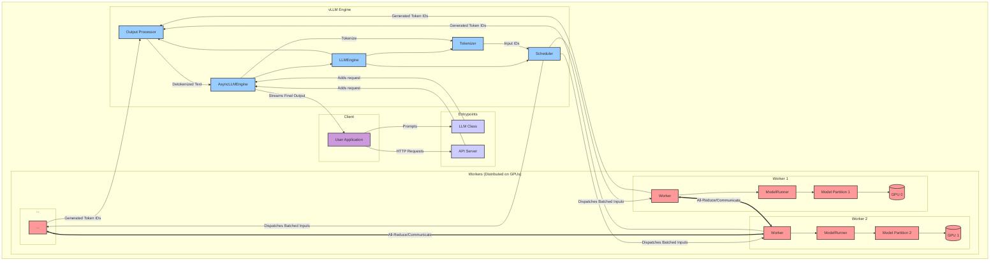

# vLLM Engine and Worker Architecture

This diagram illustrates the architecture and workflow between the vLLM engine and workers.

```mermaid
graph TD
    subgraph " "
        direction LR
        subgraph "Client"
            ClientApp[User Application]
        end

        subgraph "Entrypoints"
            LLM_Class[LLM Class]
            API_Server[API Server]
        end

        subgraph "vLLM Engine"
            AsyncEngine[AsyncLLMEngine]
            Engine[LLMEngine]
            Scheduler[Scheduler]
            Tokenizer[Tokenizer]
            OutputProcessor[Output Processor]
            
            AsyncEngine --> Engine
            Engine --> Scheduler
            Engine --> Tokenizer
            Engine --> OutputProcessor
        end

        subgraph "Workers (Distributed on GPUs)"
            subgraph "Worker 1"
                W1[Worker] --> MR1[ModelRunner] --> M1[Model Partition 1] --> GPU1[(GPU 0)]
            end
            subgraph "Worker 2"
                W2[Worker] --> MR2[ModelRunner] --> M2[Model Partition 2] --> GPU2[(GPU 1)]
            end
            subgraph "..."
                Wn[...]
            end
        end
    end

    %% Define Flow
    ClientApp -- "Prompts" --> LLM_Class
    ClientApp -- "HTTP Requests" --> API_Server
    
    LLM_Class -- "Adds request" --> AsyncEngine
    API_Server -- "Adds request" --> AsyncEngine
    
    AsyncEngine -- "Tokenize" --> Tokenizer
    Tokenizer -- "Input IDs" --> Scheduler

    Scheduler -- "Dispatches Batched Inputs" --> W1
    Scheduler -- "Dispatches Batched Inputs" --> W2
    Scheduler -- "Dispatches Batched Inputs" --> Wn

    W1 <== "All-Reduce/Communicate" ==> W2
    W2 <== "All-Reduce/Communicate" ==> Wn

    W1 -- "Generated Token IDs" --> OutputProcessor
    W2 -- "Generated Token IDs" --> OutputProcessor
    Wn -- "Generated Token IDs" --> OutputProcessor

    OutputProcessor -- "Detokenized Text" --> AsyncEngine
    AsyncEngine -- "Streams Final Output" --> ClientApp

    %% Styling
    classDef client fill:#c9d,stroke:#333,stroke-width:2px;
    classDef entrypoint fill:#ccf,stroke:#333,stroke-width:2px;
    classDef engine fill:#9cf,stroke:#333,stroke-width:2px;
    classDef worker fill:#f99,stroke:#333,stroke-width:2px;

    class ClientApp client;
    class LLM_Class,API_Server entrypoint;
    class AsyncEngine,Engine,Scheduler,Tokenizer,OutputProcessor engine;
    class W1,MR1,M1,GPU1,W2,MR2,M2,GPU2,Wn worker;
```
